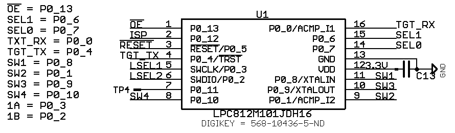
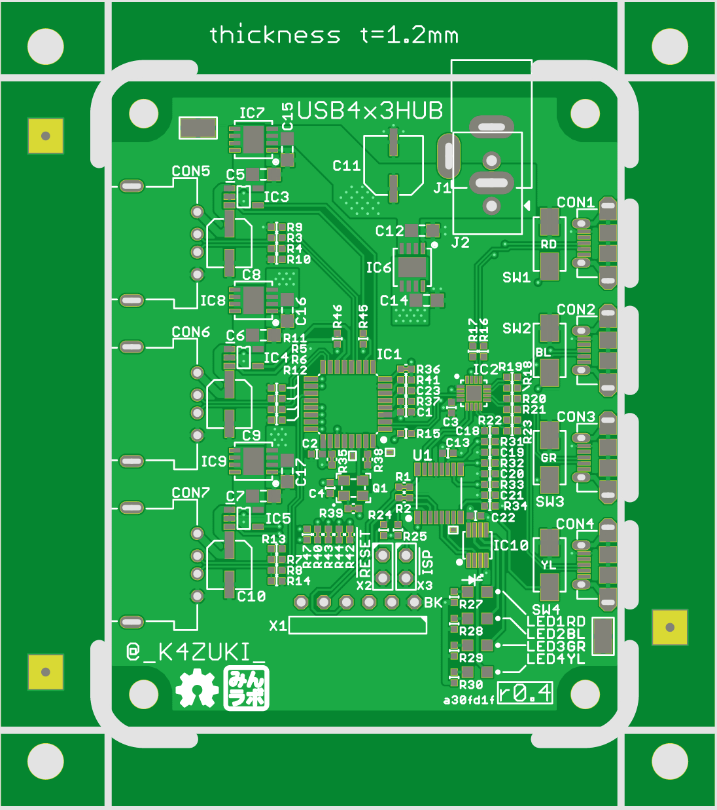

# まえがき {.unnumbered}
このドキュメントは、USB機器を最大４台のホストマシンで共有するガジェット
_**USB4x3HUB**_ のソフトウェア・ハードウェアを解説する本です。

_**USB4x3HUBプロジェクト**_ は、筆者がWindowsマシンとLinuxマシン間で **USBの**
キーボードやマウスを共有できないことに不便を感じたことに端を発する
（けど当初のことを思い出せない）プロジェクトです。

この本は、_**USB4x3HUB**_ の概要及び基本的な動作の説明、ファームウェアの説明、
そしてタカチケース用パネルの寸法図を載せても『薄い本」といえる程度にまとめる
予定です。

|        **重要**         |
|:-----------------------:|
| C91新基板間に合いません |

# USB4x3HUBの概要

_**USB4x3HUB**_ の初期のプロトタイプ -- といっても最近まで稼働していた --
はArduino形状の**mbed LPC1768**拡張基板にArduino用タッチシールド[^001]と
USBバススイッチIC[^002]をつなげ、市販のUSBハブを分解したものと秋月電子の
USBミニBコネクタDIP化キット[^004]を接続しただけの、簡素で手抜き感があるもの
でした。しかしながら近年はマイクロUSB｛ケーブル, コネクタ｝が主流になってきた
ようなので、2015年より再設計を行い、TI社の3ポートUSBハブIC[^003]と
フェアチャイルド社のUSBスイッチIC、及びスイッチ入力・USB入出力コネクタ、
それらをコントロールするmbed互換マイクロコントローラを1枚の基板に収めたものを
考案しました。

基板外形は57.5x73.0mmの縦長で、タカチの
ケース^[MX2-8-7、http://www.marutsu.co.jp/pc/i/35612/ など(650円程度)] に
ピッタリ収まる予定です。このケースはパネル分離タイプなのでパネルを自作する
こともできます^[http://www.takachi-el.co.jp/data/pdf/2016-06-041_47-50.pdf]。

## 基本的な動作

基板上のタクトスイッチを押すとスイッチと同色のLEDが点灯します。同時にUSBバス
接続が _必ず_ 一旦切断されたあとスイッチに対応したホストコネクタと再接続
されます。

基板上のスイッチは、ホストコネクタを右においたとき上から赤青緑黄の順で
実装されています。

+---------------------------------------------------------------------------+
| USBハブ側につながっているものがキーボードやマウスなら問題は少ないと       |
| 思いますが、USBメモリを接続した際は突然の切断に気をつける必要があります。 |
+---------------------------------------------------------------------------+

# 組み立てる前に：追加部品の購入
後述するケースの選定にかかわらず必要な部品があります：CON５〜７の
USB-Aコネクタです。

Table: 追加部品リスト

`Out/additionalBOM.tmd`{.include}

# 組み立てる
## ファームウェアをコンパイルする

先述の動作を淡々と実装します。LPC812マイクロコントローラの16ピンタイプを
使っていますが、[mbed.org](mbed.org)上では20ピンタイプ[^005]を
ターゲットにします。外形は異なりますがバイナリに互換性があるので20ピン用に
コンパイルされたものでも16ピン版で実行できます。

書込みはFTDIケーブルなどのUSB−UART変換ケーブルとLPC21ISP、あるいはmbed LPC1768と
**_イカ醤油ポッポ焼き_** (TM~(誰の？)~)で行います。

\newpage
`../mbed/main.cpp`{.listingtable .cpp}

## エンクロージャ（ケース）を用意する
エンクロージャ（ケース）は、頒布しません。代わりにアイデアを2点提示します。
いずれもアクリル（など）の加工が必要です。TechShopやDMM.Makeなどの工作室
を利用するなどして適宜合わせこんで自作してください。

### アイデア１：市販のケースを購入しパネルだけ自作する
タカチのケース"MX2-8-7??(??は色コード)"を使用します。ケースは上下の
パーツとパネルで構成されています。パネル部品の固定にはケースに付属している
タッピングネジを使うか、M3のタップを立てるなどもよく行われているようです。
筆者はその手の加工は苦手なのでアクリル加工と付属タッピングネジで
済ませます。

+--------------------------------------------------------------+
| 付録に基板及びパネルの寸法図を載せますので参考にしてください |
+--------------------------------------------------------------+

<!-- TODO: 他のケース候補 -->

#### パネルの穴あけ加工
前後のパネルにUSBコネクタの穴を空けます。付属品のパネルにがんばって
穴あけをするか、アクリル加工サービスなどを利用するか、タカチに加工を
依頼するなどで用意します。

デバイス（ハブ）側は穴が大きめで比較的加工が簡単です。ホスト側は
USBコネクタとLEDつきスイッチ（後述）、パネル用DCジャックを取り付けるために
けっこう密に穴あけしなければなりません。図面例は付録を参照してください。

#### 追加で必要になる部品

Table: 部品表

`Out/case1.tmd`{.include}

LEDつきスイッチ・DCジャック・端子台は秋月、ケースは千石（取り寄せ）かマルツ
（秋葉原本店なら *運が良ければ* 店頭にある）で購入できます。

LEDつきスイッチは、(半)透明アクリルパネルを自力で用意できれば普通の
押しボタンスイッチを使ってもいいと思います。リストに挙げたLEDつきスイッチは
LED色が3種類しかないので赤を4個使用するつもりで考えてあります。

DCジャックは2品種候補があります。違いは固定用ナットの位置です。
基板上には端子台のパターンが用意してありますが、おそらくDCジャックと干渉
してしまいます。回避するにはDCジャックをパネル内側ナットタイプにして
M8ネジ用のスペーサを追加するなどの工夫をするか、端子台の使用を諦めて
ケーブルを基板に直接はんだづけし、DCジャックを外ナットタイプにする
しかありません。

いっぽう端子台も2品種候補にあげてあります。
違いは部品の高さと端子ピッチです。端子台の基板パターンは5.08ミリピッチ
ですが、より低背の端子台は2.54ミリピッチなので、5V側はDCジャック用のパターンを
使用します。また、固定用ダボが付いているのでダボを削る加工が必要です。

<!-- TODO: 端子台の搭載図または写真 -->

#### 基板の加工
この本とともに頒布予定の基板には、すでにLEDが実装済みです。先述の通りパネル加工の
方針によっては基板のLEDを取り除いたほうが長持ちします。

### アイデア２：アクリル板を切り出して組み合わせる
アクリルレーザ加工で6面全てとそれらのジョイントのためにブロックスペーサ
を入手して組み合わせるという手も
考えられます^[https://gist.github.com/K4zuki/fb18026aae4fe79f22a7cca4114dfed6]。
アクリルを例にしていますが材料はなんでもいいと思います。

#### アクリル加工
6面分切ります。DCジャック側側面板はジャック用の角穴、DCジャックのない側の
側面板はファームウェア書込みピンヘッダの穴（予め書き込んでおけば穴あけ不要）、
底面版は四隅のネジ穴だけ、天板は基板上のボタンを押すためのシャフト穴、
前後パネルはUSB用を各々開け、 _いい感じに_ 組み合わせます。

#### 追加で必要になる部品

Table: 部品表

`Out/case2.tmd`{.include}

ほぼ全て秋月のみで揃います。

# 付録
\newpage
## 回路図
\newpage
`images/USB4x3HUB_r04_sch.png`{.rotate .caption="回路図" .angle=90}{}

\newpage
## 基板図

{}

\newpage
## 基板寸法とパネル寸法の例
`images/USB4x3HUB_r04-a30fd1f_meas.png`{.rotate .caption="寸法図" .angle=90}{}

\newpage
基板外形、DCジャックなどの開口部の位置寸法とMX2-8-7のパネル寸法図面を
兼ねています。

<!--  -->
[^001]: https://www.switch-science.com/catalog/1966/
[^002]: https://www.fairchildsemi.com/datasheets/FS/FSUSB74.pdf
[^003]: http://www.ti.com/lit/ds/symlink/tusb2036.pdf
[^004]: http://akizukidenshi.com/catalog/g/gK-05258/
[^005]: https://developer.mbed.org/platforms/NXP-LPC800-MAX/
