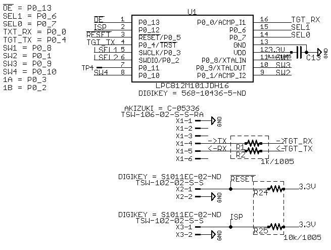

# まえがき {.unnumbered}
このドキュメントは、USB機器を最大４台のホストマシンで共有するガジェット[^007]
_**USB4x3HUB**_ のソフトウェア・ハードウェアを解説する本です。

[^007]: KVMスイッチみたいなものですかってよく聞かれます。ほぼその認識で正しいです。Vはスイッチしませんけど;)

_**USB4x3HUBプロジェクト**_ は、筆者がWindowsマシンとLinuxマシン間で **USBの**
キーボードやマウスを共有できないことに不便を感じたことに端を発する
（けど当初のことを思い出せない）プロジェクトです。

この本は、_**USB4x3HUB**_ の概要及び基本的な動作の説明、ファームウェアの説明、
そしてタカチケース用パネルの寸法図を載せても『薄い本」といえる程度にまとめる
予定です。解説する基板のリビジョンは0.5です。

## 免責事項 {-}

```table
---
# caption:
alignment: C
# table-width:
markdown: True
# inline markdown
# include:
header: False
---
"この本の内容によって読者に生じたいかなる不利益についても\\
筆者は一切責任を取りません。"
```

# USB4x3HUBの概要

_**USB4x3HUB**_ の初期のプロトタイプ
はArduino形状の**mbed LPC1768**拡張基板にArduino用タッチシールド[^001]と
USBバススイッチIC[^002]をつなげ、市販のUSBハブを分解したものと秋月電子の
USBミニBコネクタDIP化キット[^004]を接続しただけの、簡素で手抜き感があるもの
でした。しかしながら近年はマイクロUSB｛ケーブル, コネクタ｝が主流になってきた
ようなので、2015年より再設計を行い、TI社の3ポートUSBハブIC[^003]と
フェアチャイルド社のUSBスイッチIC、及びスイッチ入力・USB入出力コネクタ、
それらをコントロールするmbed互換マイクロコントローラを1枚の基板に収めたものを
考案しました。

基板外形は57.0x73.0mmの縦長で、タカチの
ケース^[MX2-8-7、http://www.marutsu.co.jp/pc/i/125226/ など(650円程度)] に
ピッタリ収まります。このケースはパネル分離タイプなのでパネルを自作する
こともできます^[http://www.takachi-el.co.jp/data/pdf/2016-06-041_47-50.pdf]。

## 基本的な動作

基板上のタクトスイッチを押すとスイッチと同色の基板上のLEDが点灯します。同時にUSBバス
接続が _必ず_ 一旦切断されたあとスイッチに対応したホストコネクタと再接続
されます。同じボタンを連打するとUSB抜き差しも繰り返し起きます。

```table
---
# caption:
alignment: C
# table-width:
markdown: True
# inline markdown
# include:
header: False
---
"USBハブ側につながっているものがキーボードやマウスなら問題は少ないと思いますが、\\
USBメモリを接続した際は突然の切断に気をつける必要があります。"
```

基板上のスイッチは、DCジャックに近い方から赤青緑黄の順で
実装されています。

## r0.5での変更点
`r0.4`までは普通のタクトスイッチが実装されていましたので、ケースに入れる場合は
パネル実装タイプのスイッチを追加するなどの工作が必要でした。
`r0.5`では子基板に側面タイプのスイッチをのせ、パネルに出すことが容易になりました。
子基板との信号接続にはピンヘッダ^[http://akizukidenshi.com/catalog/g/gC-08593] と
低背ピンソケット^[http://akizukidenshi.com/catalog/g/gC-03136]を使い、10ミリ高のスペーサを
固定の補助に使います。側面スイッチは比較的入手性のよい、互換品がたくさんあるものを選定してあります。
普通のタクトスイッチのパターンも用意してありますが、未実装です。
実装が必要なときは自力で行ってください。

メイン基板の幅が`r0.4`から若干縮まって、YM-90という汎用ケースにぴったり収まるようになりました。
基板用DCジャックがUSBホスト側にツライチになっているので穴あけの手間が少なくなります。

```table
---
# caption:
alignment: C
# table-width:
markdown: True
# inline markdown
# include:
header: False
---
"このドキュメントに載っている各種図面、ガーバデータ、原稿は\\
GitHubリポジトリに用意しています。\\
<https://github.com/K4zuki/usb4x3hub.git>\\
をご参照ください。"
```

# 組み立てる前に：追加部品の購入
`r0.5`のUSB-AコネクタはUSBケーブルを指す向きが逆になっています。

```table
---
caption: 追加部品リスト
markdown: True
alignment: CCCCCC
width:
    - 0.2
    - 0.15
    - 0.15
    - 0.2
    - 0.15
    - 0.15
---
Ref,Manuf,Part,DIGIKEY,MOUSER,適用
CON 5-7,Wurth Electronics,614104150121,732-5962-1-ND,710-614104150121,`r0.5`
X 4-7,秋月,[C-03136](http://akizukidenshi.com/catalog/g/gC-03136/),NA,NA,`r0.5`
X 8-11,秋月,[C-08593](http://akizukidenshi.com/catalog/g/gC-08593/),NA,NA,`r0.5`
"スペーサ\\
両メス\\
M3x10ミリ","\\
秋月\\
",[P-07313](http://akizukidenshi.com/catalog/g/gP-07313/),NA,NA,`r0.5`
"ネジ\\
M3x6ミリ",秋月,[P-10245](http://akizukidenshi.com/catalog/g/gP-10245/),NA,NA,`r0.5`
"ロープロファイル\\
ピンソケット\\
1x4(*)",秋月,,NA,NA,`r0.5`
```
(*): 2分割するか両端2ピンを引き抜く

\\hrule

# 組み立てる
## ファームウェアをコンパイルする

次のページに全文を掲載しますが、かなりシンプルな実装です。
LPC812マイクロコントローラの16ピンタイプを
使いますが、[mbed.org](mbed.org)上では20ピンタイプ[^005]を
ターゲットにします。外形は異なりますがバイナリに互換性があるので20ピン用に
コンパイルされたものでも16ピン版で実行できます。

<https://developer.mbed.org/users/k4zuki/code/usb4x3hub/> が実際のリポジトリです。



\\newpage
```listingtable
source: ../mbed/main.cpp
class: cpp
tex: True
---
```

## ファームウェアを書き込む
書込みはFTDIケーブルなどのUSB−UART変換ケーブルとLPC21ISP、あるいはmbed LPC1768と
**_イカ醤油ポッポ焼き_**^[https://developer.mbed.org/users/okano/code/ika_shouyu_poppoyaki/] で行います。
イカ醤油ポッポ焼きを行うときの接続表は以下のようになります。USB4x3HUBは予め電源を入れておきます。

ソースをオンラインコンパイラ上でLPC800-MAX向けにコンパイルし、ダウンロードした _usb4x3hub.bin_
を _bin_ にリネームしてLPC1768にコピーします。

```table
---
caption: イカ醤油ポッポ焼き接続表
markdown: True
---
mbed LPC1768,Function,USB4x3HUB
VOUT,3.3V supply,
GND,GND,X1-1
p25,ISP enable,X3-1
p26,UART (RX)<-(TX),X1-5
p27,UART (TX)->(RX),X1-4
p28,RESET,X2-1
```

\\newpage
## エンクロージャ（ケース）を用意する
エンクロージャ（ケース）は、頒布しません。代わりにアイデアを３点提示します。
いずれもアクリル（など）の加工が必要です。TechShopやDMM.Makeなどの工作室
を利用するなどして適宜合わせこんで自作してください。

### アイデア１：市販のケースを購入し工夫する（１）
タカチのケース"MX2-8-7??(??は色コード)"を使用します。ケースは上下の
パーツとパネルで構成されています。パネル部品の固定にはケースに付属している
タッピングネジを使うか、M3のタップを立てるなどもよく行われているようです。
筆者はその手の加工は苦手なのでアクリル加工と付属タッピングネジで
済ませました。
```table
---
# caption:
alignment: C
# table-width:
markdown: True
# inline markdown
# include:
header: False
---
付録に基板及びパネルの寸法図を載せますので参考にしてください
```

#### パネルの穴あけ加工
前後のパネルにUSBコネクタの穴を空けます。デバイス（ハブ）側は穴が大きめで比較的加工が簡単です。
ホスト側はコネクタとスイッチの穴、DCジャックのための角穴を開けます。

穴あけの方法は、付属品のパネルにがんばって手加工をするか、アクリル加工サービスなどを利用するか、
ケースメーカー（今回はタカチ）に加工を依頼するなどを提案しときます。

#### 追加で必要になる部品

```table
---
caption: 部品表
markdown: True
alignment: DDCCC
width:
    - 0.35
    - 0.35
    - 0.1
    - 0.1
    - 0.1
---
部品,型番,個数,入手先,URL
ケース,MX-2-8-7BB,1,マルツ,[125226](http://www.marutsu.co.jp/pc/i/125226/)
"ACアダプタ9V/0.65A",GF06-US09065A,1,秋月,[M-03681](http://akizukidenshi.com/catalog/g/gM-03681/)
```

スイッチはaitendoまたはマルツ（デジキーからの取り寄せ）、
ケースは千石（取り寄せ）かマルツ（秋葉原本店なら *運が良ければ* 店頭にある）で購入できます。

### アイデア２：市販のケースを購入し工夫する（２）
デバイス側を少し削るとタカチのYM-90という
メタルシャーシも使えます。千石・マルツ・共立などで買える定番品です。
MX2-8-7よりもUSB面の幅に余裕があるので固定方法に工夫がいります。
コネクタ面の穴あけはよりシビアになると考えられるのでメーカに加工を依頼するのが最短と思われます。

### アイデア３：アクリル板を切り出して組み合わせる
アクリルレーザ加工で６面全てとそれらのジョイントのためにブロックスペーサ
を入手して組み合わせるという手も考えられます。
アクリルを例にしていますが材料はなんでもいいと思います。

#### アクリル加工
６面分切ります。側面板は全面無加工が１枚と、ファームウェア書込みピンヘッダの穴
をあけたものが１枚（予め書き込んでおけば穴あけ不要）、
底面板と天板は四隅のネジ穴だけ、前後パネルはUSB用を各々開け、 _いい感じに_ 組み合わせます。

#### 追加で必要になる部品

```table
---
caption: 部品表
markdown: True
alignment: DDCCC
width:
    - 0.3
    - 0.2
    - 0.1
    - 0.3
    - 0.1
---
部品,型番,個数,入手先,URL
ACアダプタ9V/0.65A,GF06-US09065A,1,秋月 ,[M-03681](http://akizukidenshi.com/catalog/g/gM-03681/)
M3x6mmネジ,,"30\\
(概算)",秋月など,[P-10245](http://akizukidenshi.com/catalog/g/gP-10245/)
"ブロックスペーサ\\
8mm角6方向M3タッピング","\\
CB3-8-Z\\
",8,秋月,[P-07466](http://akizukidenshi.com/catalog/g/gP-07466/)
基板用DCジャック,2DC0005D100,1,秋月,[C-01604](http://akizukidenshi.com/catalog/g/gC-01604/)
自作アクリルケース,,1 set,アクリル加工サービスなど,
```

ほぼ全て秋月のみで揃います。

# 付録
\\newpage
## 回路図
\\newpage
```rotate
source: images/USB4x3HUB_r0.5-edbc0af-sch.png
angle: 90
# title: 'Alt title'
caption: 回路図
attr:
#  width: 80%
#  height: 50%
---
```
<!-- `images/USB4x3HUB-r0.5-edbc0af-sch.png`{.rotate .caption="回路図" .angle=90}{} -->

\\newpage
## 基板図

\\newpage
```rotate
source: images/USB4x3HUB_r0.5-edbc0af.png
angle: 90
# title: 'Alt title'
caption: 基板外観図
attr:
#  width: 80%
#  height: 50%
---
```
<!-- {} -->
\\newpage
## BOMリスト
DCジャック以外は全部Digikeyで購入できます。Digikey品番をMouserで検索すると
Mouserの商品ページに飛べるらしいです。

```table
---
caption: BOMリスト(r0.5)
include: data/BOM-r0.5.csv
markdown: True
---
```

\\newpage
## 基板寸法とパネル寸法の例
基板外形、DCジャックなどの開口部の位置寸法とMX2-8-7のパネル寸法図面を
兼ねています。

\\newpage
```rotate
source: images/USB4x3HUB_r0.5-edbc0af-meas.png
angle: 90
# title: 'Alt title'
caption: 寸法図
attr:
#  width: 80%
#  height: 50%
---
```
<!-- `images/USB4x3HUB_r04-a30fd1f_meas.png`{.rotate .caption="寸法図" .angle=90}{} -->

# 更新履歴 {.unnumbered}
## Revision 1.0(C91) {.unnumbered}
- 最初の発行。やばみ
- 新基板落ちた（未発送@12月24日）
- それでも本だけだしておく暴挙（）
- キンコーズでオンライン注文の予定だけど落ちるかも（）

## Revision 2.0(C92) {.unnumbered}
- 改訂。やばみ
- 表紙絵にはいらすとやさんのフリー素材を使用、ポンチ絵感ある
- `r0.4`に関連する記述を削除
- C91に間に合わなかった例の新基板（`r0.4`）は部品選定バグありだったので結果オーライ（）
- 基板はC92に間に合った（実装が間に合ったとは言っていない）
- 書いてる間もTLの諸兄のマサカリ()を受け基板リビジョンが微妙に上がっていってます()。BOMと基板図の
  微妙な違いなどはご容赦ください()

<!--  -->
[^001]: https://www.switch-science.com/catalog/1966/
[^002]: https://www.fairchildsemi.com/datasheets/FS/FSUSB74.pdf
[^003]: http://www.ti.com/lit/ds/symlink/tusb2036.pdf
[^004]: http://akizukidenshi.com/catalog/g/gK-05258/
[^005]: https://developer.mbed.org/platforms/NXP-LPC800-MAX/
[^006]: https://www.e-switch.com/system/asset/product_line/data_sheet/37/LP1.pdf
